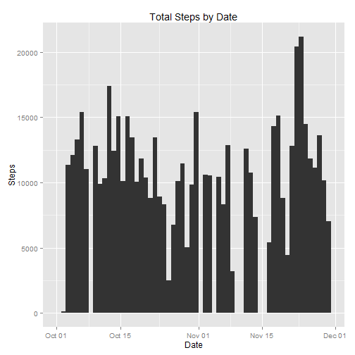
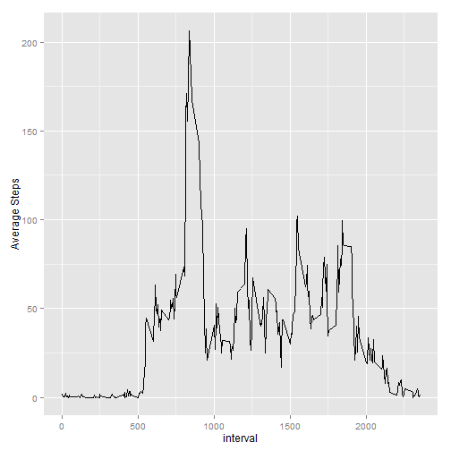

This markdown file will analyze the steps data from the Coursera website.

Loading and preprocessing the data:


```r
activity <- read.csv("C:/Users/pstap/Desktop/Coursera/05 Reproducible Research/Assessments/Peer Assessment 1/activity.csv")
```

Format the date column correctly:


```r
activity$date <- as.Date(activity$date, format = "%Y-%m-%d")
```

What is mean total number of steps taken per day?

First, we'll remove the NA's from the activity dataset


```r
activitynoNA <- activity[complete.cases(activity),]
```

Load the dplyr package and then summarize the total number of steps by date:


```r
library(dplyr)
activityByDate <- activitynoNA %>%
    group_by(date) %>%
    summarize(totalSteps = sum(steps))
```

Load the ggplot2 package and then make a histogram of steps by date:


```r
library(ggplot2)
q <- qplot(date, data=activityByDate, weight=totalSteps, geom = "histogram", binwidth = 1)
q + labs(x = "Date") + labs(y = "Steps") + labs(title = "Total Steps by Date")
```

 

Calculate the mean and median steps by date


```r
mean(activityByDate$totalSteps)
```

```
## [1] 10766.19
```

```r
median(activityByDate$totalSteps)
```

```
## [1] 10765
```

Summarize the average number of steps of each 5-minute interval, across all dates. Using dataset that has NA's removed.


```r
activityByInterval <- activitynoNA %>%
    group_by(interval) %>%
    summarize(avgSteps = mean(steps))
activityByInterval$interval <- as.numeric(activityByInterval$interval)
ggplot(activityByInterval, aes(interval, avgSteps)) + geom_line() + xlab("interval") + ylab("Average Steps")
```

 

Which 5-minute interval, on average across all the days in the dataset, contains the maximum number of steps?


```r
filter(activityByInterval, avgSteps == max(activityByInterval$avgSteps))
```

```
## Source: local data frame [1 x 2]
## 
##   interval avgSteps
## 1      835 206.1698
```

Calculate and report the total number of missing values in the dataset (i.e. the total number of rows with NAs)


```r
sum(is.na(activity$steps))
```

```
## [1] 2304
```

Fill in missing values in steps field of activity by first creating a copy of activity called activityImpute and then replace all NA's with the average number of steps


```r
activityImpute <- activity
activityImpute$steps[is.na(activityImpute$steps)] = mean(activityImpute$steps, na.rm=TRUE)
```

Summarize the total number of steps by date:


```r
activityImputeByDate <- activityImpute %>%
    group_by(date) %>%
    summarize(totalSteps = sum(steps))
```

Make a histogram of steps by date:


```r
q <- qplot(date, data=activityImputeByDate, weight=totalSteps, geom = "histogram", binwidth = 1)
q + labs(x = "Date") + labs(y = "Steps") + labs(title = "Total Steps by Date (Imputed Data)")
```

 

Calculate the mean and median steps by date. Due to imputing data, mean and median are the same


```r
mean(activityImputeByDate$totalSteps)
```

```
## [1] 10766.19
```

```r
median(activityImputeByDate$totalSteps)
```

```
## [1] 10766.19
```

Add a field to imputed data that includes day of the week. Then assign to "weekday" or "weekend" based on day of the week


```r
activityImpute$dayofweek <- weekdays(activityImpute$date)
dayofweek <- c("Monday","Tuesday","Wednesday","Thursday","Friday","Saturday","Sunday")
weekday <- c("weekday","weekday","weekday","weekday","weekday","weekend","weekend")
df <- data.frame(dayofweek,weekday)
activityImpute2 <- left_join(activityImpute,df,by = "dayofweek")
```

```
## Warning in left_join_impl(x, y, by$x, by$y): joining factor and character
## vector, coercing into character vector
```

Plot of average steps over a given interval, split between weekends and weekdays


```r
activityImputeSummary <- activityImpute2 %>%
    group_by(interval,weekday) %>%
    summarize(avgSteps = mean(steps))
library("lattice")
x <- xyplot(avgSteps ~ interval | weekday, data=activityImputeSummary,type="l",ylab="Number of Steps",xlab="Interval")
update(x, layout=c(1,2))
```

 


